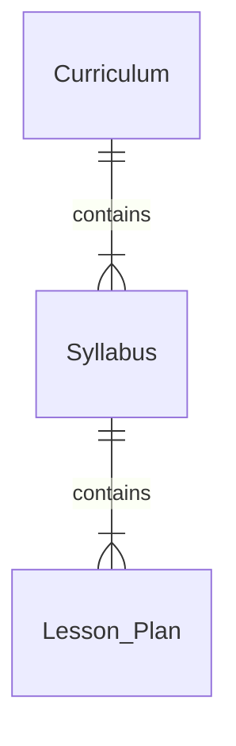

---
tags:
  - cfi
  - lesson
---

### Objective
The learner acquires knowledge and skills related to course & lesson development for aviation instruction.

### Resources
- [[CFI ACS]] Section FI.I.C
- [[AIH Ch5]]
- [[AIH Ch7]]

### Builds On
None

### Schedule
Ground 1.0 hours

### Lesson Elements

#### [[Flight Instructor Model Code of Conduct]]

#### Teaching
1. Process
	1. Organizes the material in a way that the learner can understand
	2. [[Steps in the Teaching Process]]
2. Essential Teaching Skills
	1. People Skills
		1. Technical knowledge is useless if not communicated effectively
		2. Effective communication is two-way and includes active listening to the learner
		3. Challenge the learner while supporting their efforts
	2. Subject Matter Expertise
		1. Effective instructor have a sincere interesting in learning & professional growth
		2. Networking and observing other instructors and seeking mentoring is also helpful; Be a lifelong learner
	3. Management Skills
		1. Ability to plan, organize, lead and supervise (a lesson)
		2. Manage the time effectively, plan for the unexpected
		3. Aviation instructor also need to supervise learners (ex. preflight procedures)
	4. Assessment Skills
		1. Measuring the progress (behavior change)
		2. Purpose of the assessment should be made clear

#### Course of Training
1. Commonly referred to as Curriculum, syllabus or lesson plan
2. Curriculum: multiple courses for various pilot certificates and ratings
3. Syllabus: Summary or outline of an individual course of study that includes multiple lessons
4. Lesson plan: Detailed plan for how a specific lesson will be conducted, including lesson objectives, organization of materials, description of teaching aids, instructions and learner actions, and evaluation criteria, completion standards

#### Preparation of a Lesson
1. A lesson plan must precedes instruction
2. Training Objectives & Standards
	1. Types of Objectives
		1. Performance-based: Define exactly what needs to be done and how it is done
		2. Decision-based: Use more dynamic environment and [[Scenario-Based Training|SBT]] to teach critical thinking skills, such as [[RM]] and [[ADM]]
	2. Standards
		1. Closely tied to objectives
		2. It should also include comprehensive examples; more difficult in [[Domains of Learning#Affective Domain|affective domain]] (attitudes, beliefs and value)
3. Performance-based Objectives
	1. Set **measurable**, reasonable standards
	2. Includes: description, condition and criteria
		1. Description: Desired outcome of knowledge or skills
		2. Condition: Rules for demonstration of the skill (equipment, reference, limitations, etc...)
		3. Criteria: Standards that measure the accomplishment of the objective
4. Importance of the ACS
	1. Supply specific performance objectives based on the standards for a particular aviation certificate or rating
	2. Use the maneuver-based approach of the ACS but present the objectives in a scenario situation ([[Scenario-Based Training|SBT]]))
		1. SBT-based learners has been found to exhibit same level of flying skills as maneuver-based learners but they shows better decision-making skills
5. Decision-based Objectives
	1. Designs to specifically develops pilot judgement and [[ADM]] skills
	2. Often used in teaching [[PPL4.1 Intro to Cross Country Flying|Cross Country Flying]], [[PPL5.3 Emergency Operations|Emergency Procedures]]), etc.

#### [[Guideline for Lesson Preparation]]

#### Organization of Material
1. Intro - Sets the stage for everything to come
	1. Attention - Capture learner's attention: Story, video, questions, jokes, etc.
	2. Motivation - Why the lesson content is important to know
	3. Overview - Clear, concise presentation of objectives and key ideas
2. Development - Main part of the Lesson; A few presentation options:
	1. Past to Present
	2. Simple to Complex
	3. Known to Unknown
	4. Most Frequently Used to Least Used

#### Training Delivery Methods
1. Lecture
	1. Best used to present general understanding of a subject.
	2. Teaching Lecture
		1. Planning
			1. Establish the objective and desired outcomes
			2. Researching the subject
			3. Organizing the material
			4. Planning productive classroom activities
		2. Add relevant personal experiences and supporting stats, etc
		3. Rehearse the lecture to build self-confidence and smooth out the presentation and the use of notes, aids, etc.
			1. Could use another knowledgeable person or instructor as a critic
	3. Delivery
		1. Use an extemporaneous technique; Speak from a mental or written outline but do not memorize the words
		2. Notes can be helpful if used wisely but should be used sparingly and unobtrusively (but no need to hide it from the learners)
		3. Learning is best achieved if learners participate actively in a friendly, relaxed atmosphere
	4. > [!tip] Pros & Cons of a Lecture
	   > ✅ Convenient for large groups
	   > ✅ Can be used to present information that would be difficult for learners to get in other ways (Requires research or restricted reference materials, etc.)
	   > ✅ Supplementing other teaching methods & devices
	   > ✅ A brief intro lecture can set the direction and purpose for a demonstration or to start an discussion
	   > ✅ Efficient to cover many ideas in relatively short time
	   > ❌ Requires a skilled presenter to maintain attention
	   > ❌ Difficult to get a precise reading on learners' understanding
	   > ❌ Does not work well for motor skills
2. Discussion
	1. Adding an active participation components to a lesson
		1. Use a short lecture to start and follow by instructor - learner and learner - learner discussion
		2. Develops [[ADM|Higher Order Thinking Skills (HOTS)]]
3. Guided Discussion
	1. Instead of free-form discussion, instructor can guide and control a discussion session
	2. Learners would need some level of knowledge to participate and in the process reveals their learning progress
	3. Planning
		1. Intro: Gives a brief overview and setup a relaxed, welcoming atmosphere for discussions
		2. Use lead-off question to open up an area
		3. Use follow-up questions to guide the direction: dig into learner's explanation or lead the stray discussion back
		4. Conclusion: Summarize the material covered. Tie together various points and topics discussed.

#### [[Problem-Based Learning]]
1. [[Scenario-Based Training]]
2. Collaborative Problem-Solving
	1. Instructor provides a problem for the group to solve it
	2. The instructor provides assistance only when needed, but understands that learning to solve a problem without assistance is part of the process
3. Case-Study #case-study 
		1. NTSB aviation accidents is an excellent source of real-world case studies

#### e-Learning
1. Computer-Assisted Learning (CAL)
	1. Use computer / tablet with software
	2. FAA test prep guide software is useful for preparing for knowledge tests
2. Simulation, Video Games
	1. Simulators (BATD, AATD, Full-motion Simulator)
	2. Video Games (X-plane, MSFS, etc.)
	3. 
	   > [!caution] Simulators can be a double-edged sword
	   > For some areas where they can help or hurt with training, check out [How to Leverage a Simulator for Flight Training](https://cfijack.com/how-to-leverage-a-simulator-for-flight-training/) from [[CFI Jack]]

#### Cooperative or Group Learning
1. Organize learners into small groups to maximize understanding
2. Instructor needs to plan early to determine what group should be able to do on their own
3. Conditions and controls:
	1. Small, heterogeneous groups
	2. Clean, complete instructions: What to do, in what order, with what materials
	3. Individual accountability
	4. Recognition and reward for group success
	5. Time after completion for learners to systematically reflect upon how they worked together as a team

#### Demonstration-Performance
1. Best used with mental or physical skills that requires practice
2. Five Phases: Explanation, Demonstration, Learner Performance, Instructor Supervision and Evaluation

#### Drill and [[CFI1.3 Learning Process#Types of Practice|Practice]]
1. Law of exercise: Connections are strengthened with practice

#### Application and Assessment
1. The learner should have use of the skills they learned: Forming good habits and filter out faulty habits
2. Each lesson should conclude with an assessment
	1. Review of what has been covered
	2. Ask learners to demonstrate how well the objectives has been met with
	3. It can be used to inform the next lesson and/or logged formally and tracking learner's progress

#### Instructional Aid
1. Devices that assist an instructor in the teaching-learning process
2. Key Theory
	1. Covers the key points & concepts
	2. Straightforward and factual
	3. Best if relatively simple
3. Reasons for the use
	1. Help gain and hold learners' attention
	2. Help with understanding and retention
	3. Solves certain language barrier problems
	4. Clarify relationships between material objects and concepts
	5. Saves time
4. [[Guideline for Use of Instructional Aids]]
5. Types of Instructional Aids
	1. Marker Board
	2. Supplemental Printed Material
	3. Enhanced Training Materials
	4. Projected Material
	5. Video
	6. Interactive Systems
	7. Computer-Assisted Learning
	8. Models, Mockups and Cut-Aways

#### Integrated Flight Instruction
1. Flight maneuvers is taught to performed by both visual & instrument references
	1. Develops habits of continuously monitoring their own and aircraft's performance
	2. Gains better operating efficiency and aircraft performance through more accurate flying
2. Procedures
	1. Start from the beginning: Includes both expected instrument indications to briefing and outside references
	2. Constantly integrated into all lessons
3. [[See and Avoid]]
	1. Make sure learners develop the habit of [[Scanning for Traffic|scanning for traffic]] at all times
	2. Do not let them assume instructors are assuming all responsibilities for traffic avoidance

#### Planning Instructional Activity
1. Blocks of Learning
	1. Constitute necessary parts of the total objective; see [[~ PPL Blocks of Learning.png]] for an example
	2. They denote units of learning which can be measured and evaluated and then build upon, not sequentially.
		1. > [!example] Blocks for Pre-solo
		   > An example of pre-solo building blocks can look like:
		   > ![[Pre-solo Blocks of Learning.png]]	   
    3. Blocks should be truly integral parts, extraneous blocks are expensive frills and detract from the final objective
    4. Give learners a sense of accomplishment and boost in self-confidence everytime they complete a block. Each one of the block is also more manageable.
2. Training Syllabus
	1. Practical guide for logical sequencing of the lesson and ensuring all requirements and completed and properly documented
	2. A brief yet comprehensive outline of most efficient way of training
	3. Relies on the blocks of learning, establishing objectives and standards for the overall course, separate ground and flight segments, recommended class time and each stage of training
	4. Using a Training Syllabus
		1. It should be flexible and used primarily as a guide
			1. Order of training should be modified to adapt learner's prior experience or other demands
			2. Instructor must consider the effects on learning blocks when departing from the syllabus
		2. Ground Lessons
			1. Focus on the [[Domains of Learning#Cognitive Domain|cognitive domain]] of learning
			2. Instructor should stress [[ADM]], safety factors with traditional aviation subjects to favorably influence a learner's attitude, beliefs and values
		3. Flight Lessons
			1. Emphasize on the [[Domains of Learning#Psychomotor Domain|psychomotor domain]] domain
				1. Also [[Domains of Learning#Affective Domain|affective domain]]: Learner's attitude towards safety, [[ADM]] and judgement should be a major concern
	5. Syllabus should include risk management sections and the scenarios should be increasingly subtle risks so learner gets more skilled at identification and mitigation
3. Lesson Plans
	1. Organized outline for a single instructional period
	2. Lesson plan should not be a mental outline but a written plan
	3. Can be made into record-keeping forms
	4. Characteristics of a well-planned lesson
		1. Unity - Each lesson should be a unified segment of instruction
		2. Content - Each lesson should contain new material
		3. Scope - Each lesson should be reasonable in scope
		4. Practicality - Each lesson should be planned in terms of the conditions under which the training is to be conducted. (Airplane or Simulator? VMC or IMC?)
		5. Flexibility - A degree of flexibility should be incorporated so add-on materials can be used if required
		6. Relation to course of training - Each lesson should be planned and taught so that its relation to the course objectives is clear
		7. Instructional steps - Every lesson should falls logically into the four steps of the teaching process: preparation, presentation, application and evaluation
	5. Refer to [[AIH Ch7]] for examples of lesson plans

### Completion Standards
None

### Required Logbook Phraseology
None

### Required Homework
None

### Recommended Homework
None

*Return to [[~ CFI Lesson Plan|Table of Contents]]^*
